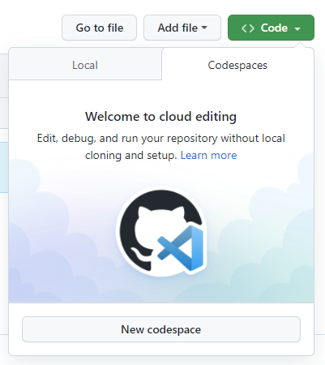

# .NET App Seed

This is an application seed to quickly get started with containerized .NET application development using GitHub Codespaces.

## Features

Application

- ASP.NET 5 Web API project with tests
- Wired for integration with external observability solutions via Prometheus metrics
- Ready for container development with a multistage `Dockerfile`

Inner loop development

- Preconfigured VS Code environment
  - Ready for `F5` debugging
  - Tasks for `Build`, `Run`, and `Test`
  - Curated extensions

> Note: there is an [open issue](https://github.com/github/feedback/discussions/5590) affecting launch tasks in the browser. Connecting to your Codespace from desktop VS Code will enable you to debug your app

Container inner loop

- Local k8s development cluster
- The `Run in local cluster` VS Code task
  - builds your image
  - launches your app inside your local cluster
  - configures a route to access your app
- `Reset local cluster` can teardown and bring your local cluster

### (optional) Kubernetes development

If you'd like to opt-in to a k8s-aware development experience

- Use the provided `Enable k8s development` task to
  - Configure VS Code with additional extensions
  - Launch [Octant](https://github.com/vmware-tanzu/octant) to interact with your local cluster in a web interface (forwarded port `7777`)
- In the terminal, `kubectl` is available and pointed at your local cluster

## Getting Started

[Use this template](https://github.com/microsoft/dotnet-api-template/generate) to create a new repository


In your repository, create a new Codespace



### Application Development

After the Codespace is created, your development environment is ready to go! Try some of the following tasks:

- Press `Ctrl+Shift+B` to build your app
- Hit `F5` to start debugging
- Run your app
  - Open `Tasks: Run Task` (press `Ctrl+Shift+P`), type and select `Tasks: Run Task`, then `Run` to launch your app in watch mode
  - Now, from `Tasks: Run Task`, select `Open Port in Browser` and choose port `5000` to visit your running app
    - `/healthcheck`: confirm the service is up and *Healthy*
    - `/metrics`: view the metrics configured to be scraped by Prometheus

### Container Development

Your Codespace has a preconfigured running cluster so that you can validate how your application will behave when deployed

- From `Tasks: Run Task` (press `Ctrl+Shift+P`), select `Run in local cluster`. Your app will load in a new browser tab.
- To reset the local cluster for any reason, you can use the `Reset local cluster` task

Your Codespace also has a local portal that exposes a number of services that will also be present when your app is deployed

- Using `Tasks: Run Task`, select `Launch Platform Portal in New Tab`
- The application increments a metric named `hits` each time the "Hello, World!" path is used. From the portal, use [Prometheus](https://prometheus.io/) to query app metrics
- [Grafana](https://grafana.com/) is also available for visualization. The instance is local to your Codespace with the following settings:
  - The default username/password is: `admin`/`admin`
  - The local Prometheus URL to set up a data source is `http://traefik.kube-system/.platform/prometheus`

> You can also view the list of [forwarded ports](https://docs.github.com/en/codespaces/developing-in-codespaces/forwarding-ports-in-your-codespace) available to your Codespace in the `PORTS` tab in the Integrated Terminal

### Configuring a different Container Registry

This environment comes with github actions to build and push the application containers to the GitHub container registry.

If you wish, you can configure the repo to use the container registry of your choice by [creating the following secrets in the repository](https://docs.github.com/en/actions/reference/encrypted-secrets#creating-encrypted-secrets-for-a-repository):

- CONTAINER_REGISTRY_URL
- CONTAINER_REGISTRY_USER
- CONTAINER_REGISTRY_ACCESS_TOKEN

These values can be obtained from your specific container registry provider.

> **Note**
>
> To return to the default, simply remove the secrets from the repository.

## Application Deployment

The process of deploying an application is dependent on the team that manages the platform. This team makes application templates available. These templates describe the
configuration values that are required for the deployoment.

The team will require the creation of a properly configured ```app.yaml``` file.

A sample of this file exists in the root of this repo.

## Contributing

This project welcomes contributions and suggestions.  Most contributions require you to agree to a
Contributor License Agreement (CLA) declaring that you have the right to, and actually do, grant us
the rights to use your contribution. For details, visit https://cla.opensource.microsoft.com.

When you submit a pull request, a CLA bot will automatically determine whether you need to provide
a CLA and decorate the PR appropriately (e.g., status check, comment). Simply follow the instructions
provided by the bot. You will only need to do this once across all repos using our CLA.

This project has adopted the [Microsoft Open Source Code of Conduct](https://opensource.microsoft.com/codeofconduct/).
For more information see the [Code of Conduct FAQ](https://opensource.microsoft.com/codeofconduct/faq/) or
contact [opencode@microsoft.com](mailto:opencode@microsoft.com) with any additional questions or comments.

## Trademarks

This project may contain trademarks or logos for projects, products, or services. Authorized use of Microsoft
trademarks or logos is subject to and must follow
[Microsoft's Trademark & Brand Guidelines](https://www.microsoft.com/en-us/legal/intellectualproperty/trademarks/usage/general).
Use of Microsoft trademarks or logos in modified versions of this project must not cause confusion or imply Microsoft sponsorship.
Any use of third-party trademarks or logos are subject to those third-party's policies.
